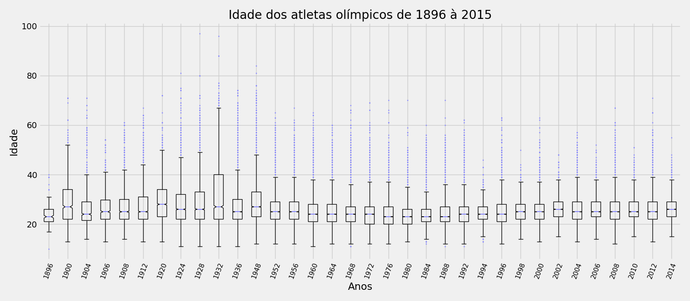

## Visualização de dados de olimpiadas por meio de gráficos usando a lib `matplotlib` :
#### Opções de escolha dos Gráficos:

* L9. Evolução da idade média dos atletas do <Gênero> que ganharam medalhas em
alguma das Olimpíadas

* B12. Altura média dos atletas para um grupo de <Esportes> na olimpíada de <Ano>
de <Tipo de Olimpíada>, separados por sexo.

* X1.Idade dos atletas a cada ano.

* T2. Qual o(a) atleta que mais ganhou medalha de <Tipo de Medalha>?

* E. Quantidade de medalhas, ouro, prata e bronze, (uma barra pra cada) para os 5 primeiros países colocados de um determinado invervalo de ano.

## Run 
- main.py
  
 ## Examples:

  

